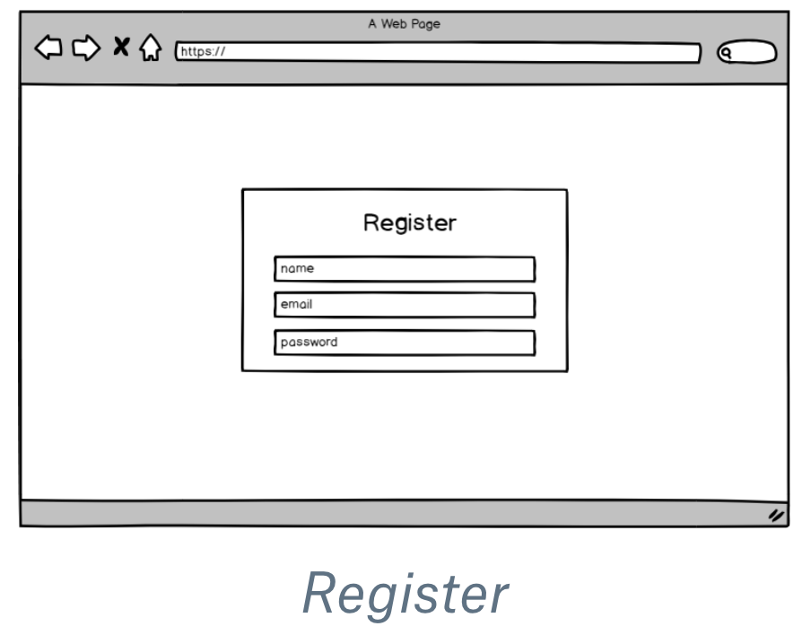
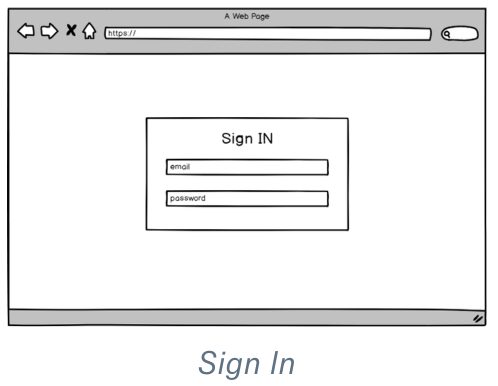
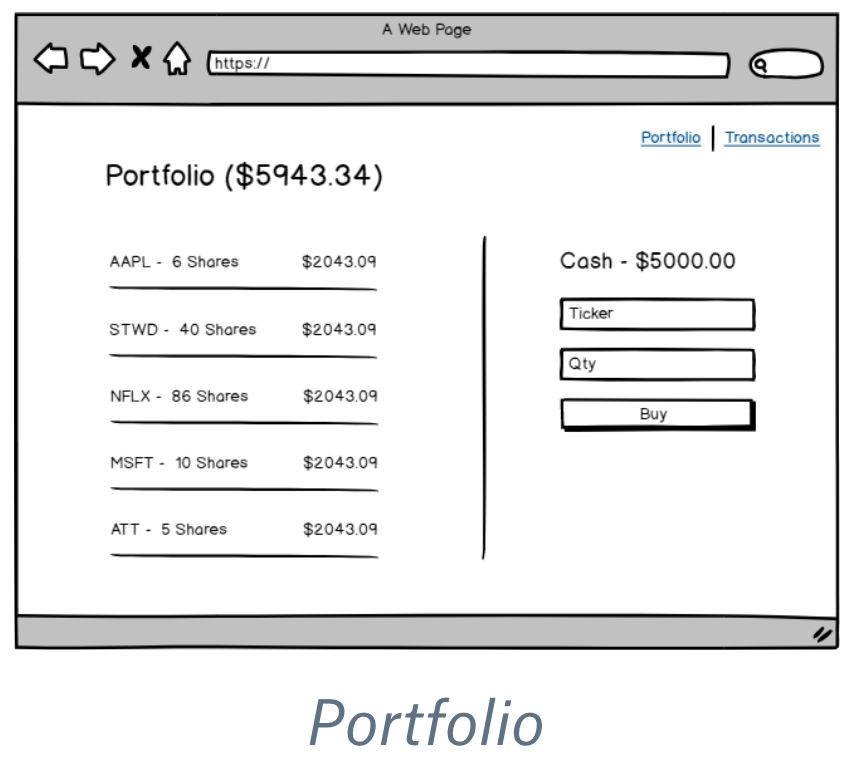
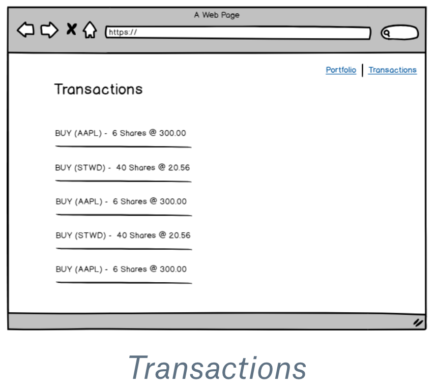
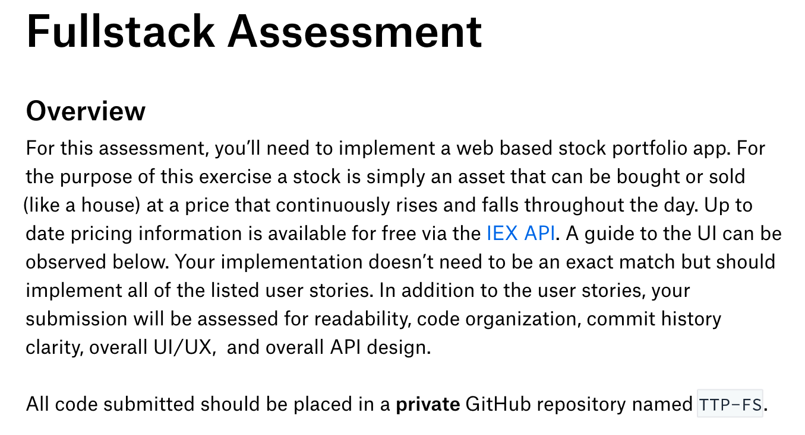

# TTP-FS

TTP_FS is a fullstack web based stock portfolio application with real time stock quotes provided by the [IEX API][iex api].

[iex api]:https://iextrading.com/developer/docs/#getting-started

_Technologies, frameworks, and libraries used include:_  

__Backend:__
- [X] Express
- [X] Node
- [X] Postgresql
- [X] Passport

__Frontend:__
- [X] React
- [X] Redux
- [X] Axios
- [X] Material-UI
- [X] Socket.IO

### Wireframes

Route URL | `/register`  
-|-

---

Route URL | `/signin`  
-|-

  
--

Route URL | `/portfolio`  
-|-

--

Route URL | `/transactions`  
-|-

--

### User Stories

--

- [X] 1.0 registration requires name, email, & password  
- [X] 1.1 default balance $5000  
- [X] 1.2 registration requires unique email  

- [X] 2.0 authentication requires email & password  

- [X] 3.0 buying stock requires ticker symbol & quantity   
- [X] 3.1 quantity must be integer  
- [X] 3.2 buying stock requires balance >= ( stock price * quantity )  
- [X] 3.3 buying stock requires valid ticker symbol  

- [X] 4.0 transactions list view  

- [X] 5.0 portfolio ( stock details ) list view  
- [X] 5.1 real time stock price * quantity owned  

- [ ] 6.0 dynamic portfolio font colors  
- [ ] 6.1 current stock $ < day open $ = red  
- [ ] 6.2 current stock $ = day open $ = gray  
- [ ] 6.3 current stock $ > day open $ = green  

### DB Schema

__users__  

column | data_type | details
-|-|-
id | integer | SERIAL PRIMARY
user_name | string | UNIQUE NOT NULL
email | string | UNIQUE NOT NULL
password_digest | string | NOT NULL
created_date | date | DEFAULT CURRENT_TIMESTAMP

__balance__  

column | data_type | details
-|-|-
id | integer | SERIAL PRIMARY
user_id | integer | REFERENCES users(id) ON DELETE CASCADE NOT NULL
total | string | NOT NULL

__transactions__  

column | data_type | details
-|-|-
id | integer | SERIAL PRIMARY
user_id | integer | REFERENCES users(id) ON DELETE CASCADE NOT NULL
stock_symbol | string | NOT NULL
sale_price | string | NOT NULL
quantity | integer | NOT NULL
created_date | date | DEFAULT CURRENT_TIMESTAMP  

___NOTE:___    
Prices are saved in the db as strings in the backend and then converted to numbers on the frontend to preserve accuracy when dealing with currency.  

__API__  

type | endpoint | details
-|-|-
POST | `/api/balances` | initBalance  
PATCH | `/api/balances` | updateBalance  
GET | `/api/transactions/:email` | getTransactions  
POST | `/api/transactions` | handleTransaction  
GET | `/api/users/isAuthenticated` | isAuthenticated  
GET | `/api/users/:email` | getUser  
POST | `/api/users/register` | registerUser  
POST | `/api/users/signin` | signinUser  
POST | `/api/users/signout` | signoutUser  
DELETE | `/api/users/:email` | deleteUser  

__TODO:__
- [ ] Refactor & handle error codes
- [ ] Deploy to Heroku

___FOR REFERENCE:___   

---
